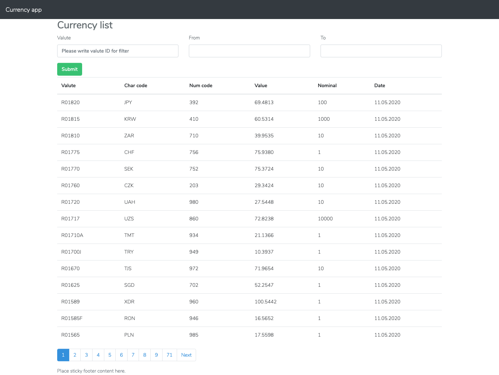

# Test Currency parser project

This app build for review. Please refer to task.md file.

## Configuration:
1. Clone project
`` git clone https://github.com/jasco-b/test-currency-parser.git``
2. Change your dir
3. install composer dependencies
``composer install``
4. Copy .env.example file as .env
`` cp .env.example .env``
5. Configure db
6. Migrate and seed
`` php artisan migrate --seed``
7. install npm dependencies
`` npm install``
8. Compile js and css assets
`` npm run dev``
9. Run server 
`` php artisan server``
10. On your web browser use http://localhost:8000 :)

## This project has test
Run test
`` php artisan test``

## Task 1. Console commands
1. Parsing by Date (Daily)
`` php artisan currency:parse 2020-12-12``
2. Parsing by Valute and date from and to
`` php artisan currency:valute  R01820 --from=10.10.2019 --to=15.10.2019``

## Task 2. API
Api can filter by following params: valute, from and to.

Valute is valute id.

From and To is date in the format d.m.Y eg: 10.10.2019

``{host}/api/currencies/prices``

## Task 3.
I have used React.js for this task

